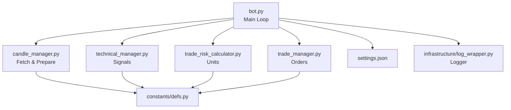

CLOUD_BOT_v7_Python  
Smart • Modular • Python-Driven Trading Framework

CLOUD_BOT_v7_Python is a clean, modern trading framework designed to focus on **Python architecture**, readability, and maintainability.  
This version is ideal for Python learning, experimentation, and building real automated systems.

---

## ⭐ Key Goals
- Clean Python architecture  
- Modular components  
- Clear strategy implementation  
- Strong logging system  
- Config-driven behaviour  
- Future-proof structure  
- Easy to extend (ML, backtests, multi-strategy, automation)

---

## 📁 Project Structure

CLOUD_BOT_v7_Python/
│
├── bot.py # Main trading loop
├── settings.json # User-modifiable settings
├── requirements.txt # Python dependencies
│
├── constants/
│ └── defs.py # API keys, URLs, loader functions
│
├── infrastructure/
│ └── log_wrapper.py # Central logging system
│
├── modules/
│ ├── candle_manager.py # Fetches OHLC candles
│ ├── technical_manager.py # Strategy logic + indicators
│ ├── trade_manager.py # Executes trades
│ └── trade_risk_calculator.py # Calculates safe units
│
└── logs/
└── main_YYYYMMDD.log # Auto-created daily logs

---

## 🧠 Architecture Diagram



---

## ⚙️ How It Works (Simple Explanation)

### **1. bot.py**
Controls the system:
- fetch candles  
- generate signal  
- calculate units  
- place trades  
- log everything  

### **2. candle_manager.py**
Downloads OHLC candles from OANDA.

### **3. technical_manager.py**
Applies MA + STD logic to create BUY / SELL / None.

### **4. trade_risk_calculator.py**
Converts risk per trade → safe units.

### **5. trade_manager.py**
Sends orders safely to OANDA.

### **6. log_wrapper.py**
Creates daily rotating logs.

---

## ⚙️ Installation

```bash
git clone https://github.com/AG-Sec4/CLOUD_BOT_v7_Python.git
cd CLOUD_BOT_v7_Python
pip install -r requirements.txt
```

---

## ▶️ Running the Bot

```bash
python bot.py
```

Logs appear in:

./logs/main_YYYYMMDD.log

---

## 📘 Glossary (Quick)

**MA** — Moving Average  
**STD** — Standard Deviation  
**SL/TP** — Stop Loss / Take Profit  
**Granularity** — Candle timeframe  
**Units** — OANDA position size  

---

## 📈 Ready for Future Expansions

- ATR trailing stop  
- Volatility filters  
- ML/AI indicators  
- Backtesting engine  
- n8n or Discord alerts  
- Multi-strategy engine  
- Equity tracking  

---

## 🚀 Enjoy Building

This version is built to grow with your Python skills.  
Extend it. Improve it. Automate it.
